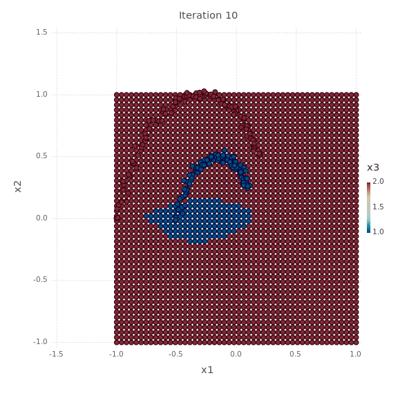
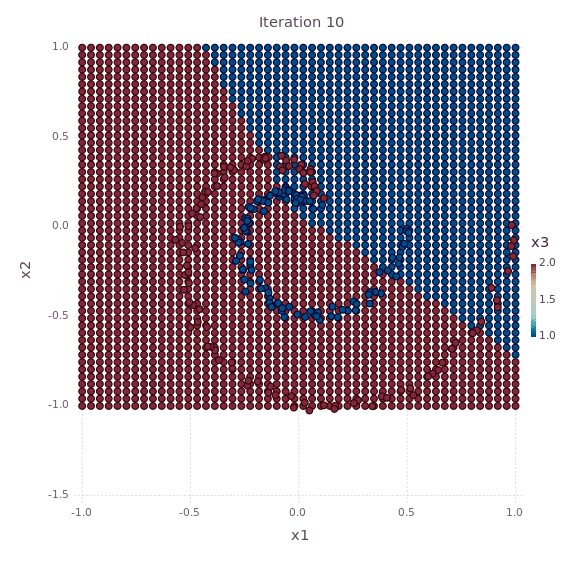

# NeuralNetworks
Learning about Neural Networks

# Results

## Regular Linear Regression


## 2 Layer Neural Net


## 2 Layer Neural Net - Spirals


## 2 Layer Neural Net - 3 Spirals


# Running
`./run.sh` will start a docker image with the appropriate jupyter notebooks

## Generate gif of learning process
The notebook will output SVG images in `/notebooks/images` as the algorithm goes on. If you would like to generate a gif animation use the following command in the `notebooks/images` folder:

```bash
convert -delay 20 -loop 0 *.svg output.gif
```
